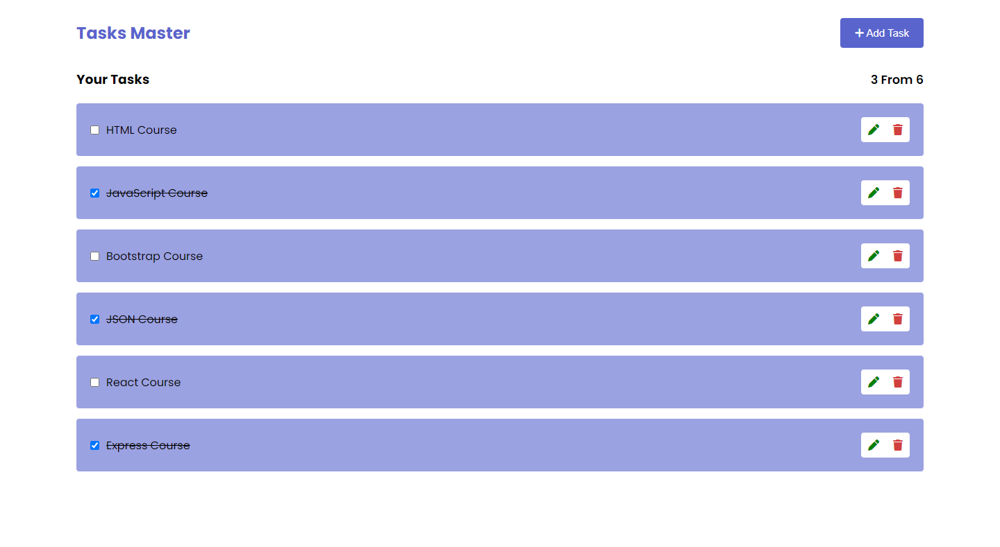
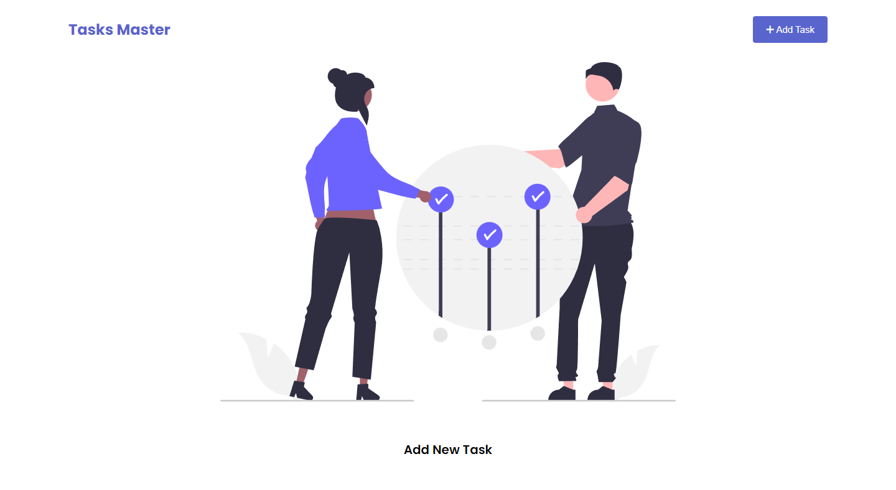

# Tasks Master
### Simple To-Do list App.

## User Stories:

1. As a User, I want to be able to see all todo's I have.
2. As a User, I should be able to add a new todo (name).
3. As a User, I can mark todo as a done/undone.
4. As a User, I can delete any todo I want.
5. As a User, I should be able to edit any todo I have.
6. As a User, I want to see the number of todos I have in my list and completed todos

## Technologies Used:

- HTML
- CSS
- JavaScript
- Local Storage

## View Demo

[View Demo](https://khaledaref13.github.io/Tasks-Master/)
